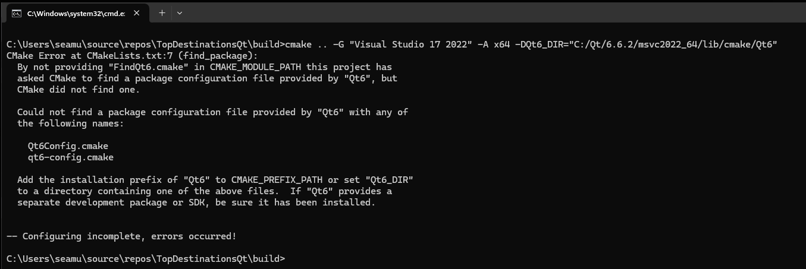
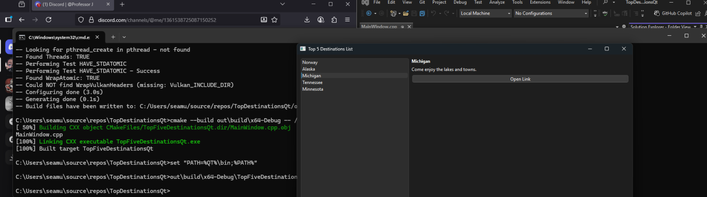

# **Enhancement One: Software Design and Engineering**

This artifact was initially one of the first coding projects, from CS250, where I created
a Top 5 Destinations List of locations with a link and picture for the user(s) to see
and click on and explore with. This project was created some time in July or August of
last year, and was a test to see how I would be able to improve already existing code
(Java specifically) and add some more depth to it, allowing users to be able to look at
pretty pictures of different locations and have a link to a travel guide for them to
look at it if they get interested in the chosen location. 

I mainly chose this item to demonstrate my ability to port one project’s code from one
language to another, as well as adding some improvements to it. I personally haven’t 
had much experience with C++, maybe one or two courses, and comparing it to my experience
with Java or Python, I can say I am more comfortable with Java or Python. Being able to
not only translate preexisting code from a language I am comfortable with to a language
I don’t have much experience with helps showcase my skills in adapting and overcoming
new challenges that I am faced with. After doing some research and investigations, I learned
that C++ doesn’t have the same structure that Java did for this project, when listing the
files/images for the user(s) to see, so I had to learn an entirely new piece of C++ tech
called CMake. Having to learn this program or new tech was very challenging, especially as I
have never used this program before and had to spend a lot of time testing and trying to fix
different issues with the program. The artifact was improved by having newer images
attached to the page, and by having a completely new way of orientating the lay out
of the project for the user(s) to see. The code was refined to be as reusable as possible
while also maintaining the core functionality of the project. 

The chosen artifact was pulled from CS 250: Software Development Lifecycle, this 
demonstrated my ability to use well founded and innovative techniques as I ported this
project from Java into C++ and made it closely match what the initial program was when
it was ran in Java. The initial Program was created as an executable that opened a browser
page that showed a list of different destinations that the user can click on, and it would
take them to a travel page where they can get information about that specific destination.
When translating it to C++, I had to learn and utilize CMake to build the project since C++
doesn’t have ‘Swing’ capabilities since that is a Java function. Learning a new program as
well as porting a Java application into C++ was not an easy task but after successfully
creating an executable that provides almost the same functionality as the Java program but
in another language and using a different tool to program it, I can confidently say I
successfully used well-founded and innovative techniques to improve this artifact. Looking
at it from the collaborative side, providing links or tools to reach out towards other
websites or links provides a collaborative effort with other developers as building an
application or program that connects with other areas of the Computer Science field helps
improve the overall quality of work with other areas and provides a good working relationship
with different areas of profession. Having only pictures gives a nice visual towards the
application but adding more interactables such as links makes a world of difference, as it
feels more cared for and helps connect from one development of the Computer Science world
to another. 

There were a lot of challenges that I had to overcome when modifying this artifact. Figuring
out how to properly use and run CMake was a struggle as there isn’t much support or knowledge
bases, at least that I could find, that helped me figure out my issues or what to do and what
all to download. Having to constantly go through the installers and figure out what little
box I didn’t check to get access to a specific tool was the most tedious process, as finding
out I did everything right just to not see something work and finding out something wasn't
installed was time consuming. This was honestly a very lengthy process, and I am content with
how it turned out but it definitely took it's time. I learned the importance of paying
attention to all the little details, especially the version numbers as finding out that the
entire executable didn't want to work because I put 6.6.2 instead of 6.9.2 really annoyed me
as I was stuck for days as to why this command didn’t work. I struggled to find out why the
command prompt would keep spitting out errors even though I clearly detailed the path towards
the tools was part of what I struggled the most with, as there was a lot of set up issues as
I was downloading all of these tools with little to no experience with them. 

Overall, this was a great learning experience, and I learned that making sure little pieces of
the project worked before doing the entire program was the way to go. Below will be a pictur of
me making the actual program works before adding in the images, to where it will look like the
image above. 

[Link to Artifacts Initial Repository](https://github.com/IssaihPerez/CS250-Software-Development-Lifecycle)
