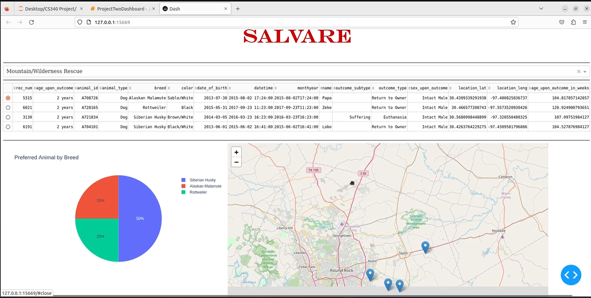

# **Enhancement Three: Databases**

This artifact came from CS 340: Client Server Development and is the
final artifact I have chosen to refine for my ePortfolio. This project
was a mix of database technology and website development, as this project
utilized CRUD functionality (Create, Read, Update, and Delete) and displays
data on a dashboard that will be displayed on a browser. This was initially
set up where the database portion was separate from the dashboard piece,
and although they are connected they are access differently. You would
initially access the database using hard coded credentials and use the 
CRUD function to edit the database however they would want, and once that
is done they can access a separate .py file that displays the dashboard. 
The dashboard would then display a table, pie chart, and map of Texas. 
There were different filters options that sort down the different types
of animals, like bird, cat, dog, or a different animal rescue and the 
chart and map would update depending on the filters chosen. 

The inclusion of this artifact is a mix of several different course
specialties into one, and demonstrates my ability to design, develop,
and deliver professional quality work that is coherent and technically
sound as well as develop a security mindset that anticipates adversarial
exploits. The artifact was primarily created using Python as it utilizes
.ipynb and .py files to create a database structure and website application. 
Instead of accessing the files separately, like mentioned above, I refined
the code to where you can access all the functions in one area instead of
needing to access them both separately. The CRUD functionality was adjusted
to be more defensive and protect against other vulnerabilities that the inital
code didn't check for, such as more thorough checks for empty spaces and
null values, as well as error throwing if the user enters in incorrect syntaxes.
To better protect user credentials, I also added in .venv values to help protect
user data instead of having it hardcoded into the system.

Although there was a lot of success in the refinement of this application,
there were a couple of snags that got in the way of this artifact. One big
concern was about the Jupyter Dash environment, as there seems to be an
issue with the way that the Dash server inside of Jupyter was installed on
the initial environment, as the initial files were updated from the Virtual
Lab. The other code works and returns the expected variables but the
dashboard is refusing to run due to a server run issue within Dash. Although
there was more success than issues, it did help me learn how to be more defensive
in my coding as well as what to look for when I am trying to determine additional
features to add to my work. 

[Link to Artifacts Initial Repository](https://github.com/IssaihPerez/CS340-Client-Server-Development)