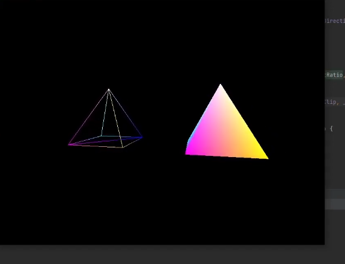
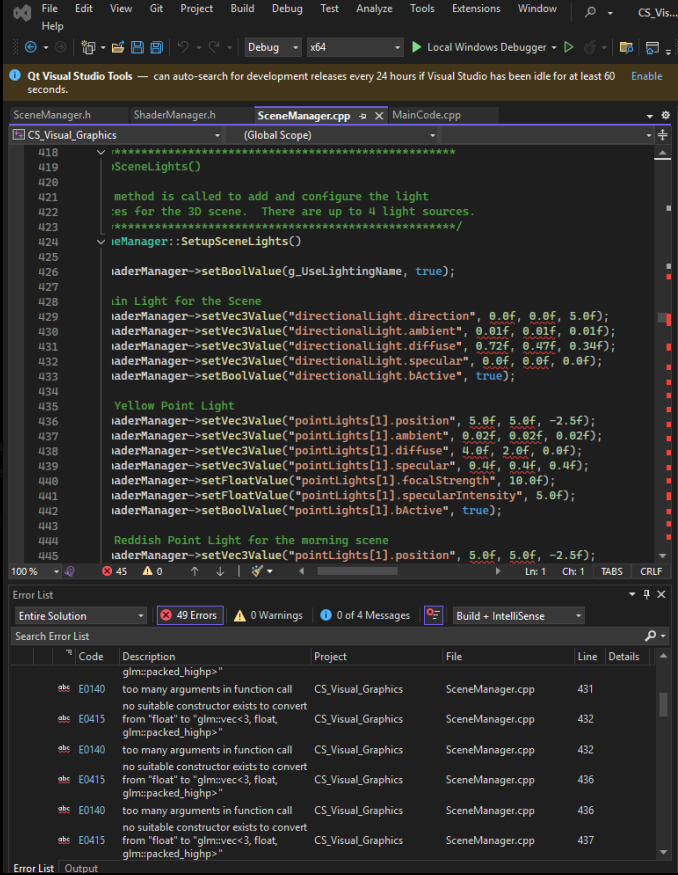

# **Enhancement Two: Algorithms and Data Structures**

This artifact was a project I had done closer towards my Sophomore year of
my Computer Science Degree, and was one of the first couple projects where I
learned about visualizing and designing different scenarios using code. This
project came from CS 330: Computational Graphics and Visualization
utilized code to create 3D shapes and sceneries, where the 3D objects
were created and adjusted using textures, as well as lighting sources to mimic
real life scenes. This experience was very fascinating as the limit was really
up to you and your imagination. 

This artifact showcased my ability to provide appropriate solutions to
projects while balancing the trade-offs that come when choosing different
design choices. This project was built using SNHU's Virtual Lab, which
unfortunately led to some complications with the programming of the project
as I didn't have some of the files needed to run the program. After some
digging and retracing I was able to find some older versions of the program
and had to update them to get them to where I needed them to be for this
enhancement. This artifact was the most time consuming of the three as the
limiting factor was how much time I was able to put into it and the limits
of my imagination. Balancing various elements such as Lighting, Shapes,
Textures, Pitches, and other such elements was a tedious task but showcased
my ability to choose the best path of what to turn in to both my course
instructors and future clients. 

The biggest challenge I faced when working on this project was due to the
files not being there as they weren't saved into the local repository, so for
the ShapeMeshes file I reached out to get as it was over 2,000 lines of code
long but everything else I recreated from the old files I had and updated
them to be more current. Not only was this a test to my adaptiveness and
creativity, it showcased my ability to minimize the risk or damages that might
have been incurred if I was not able to come up with the various solutions
I did to get this project working. Below would be one of the many errors I would
get when trying to recreate the files from scratch, as well as getting the files
to be as current as can be, while making sure the program ran. 

[Link to Artifacts Initial Repository](https://github.com/IssaihPerez/CS330-Comp-Graphic-and-Visualization)