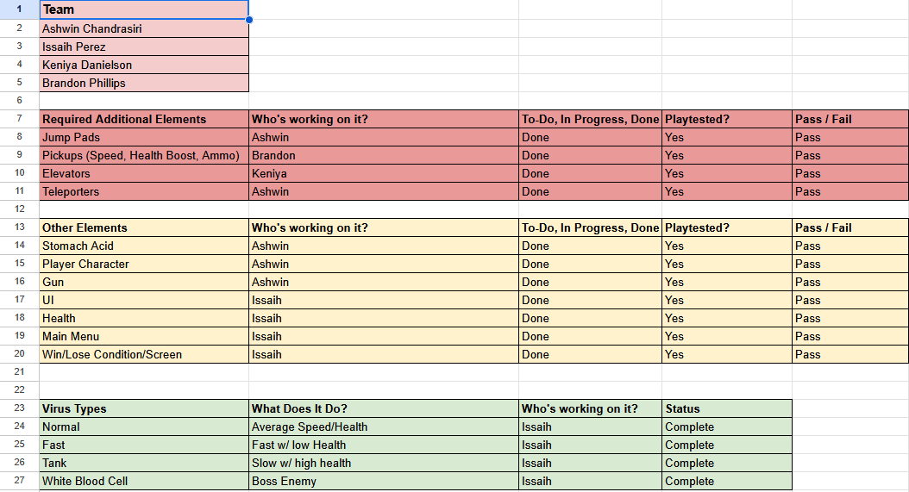
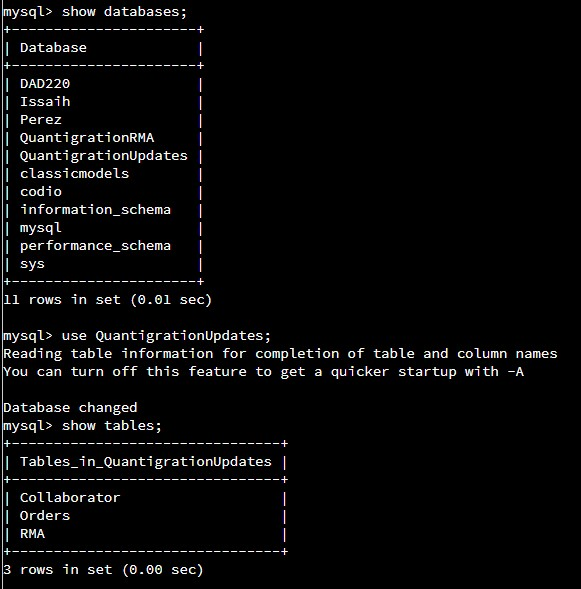
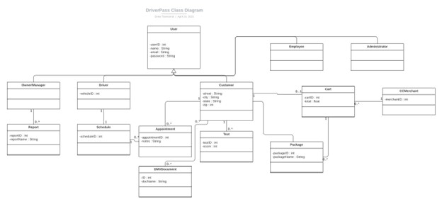
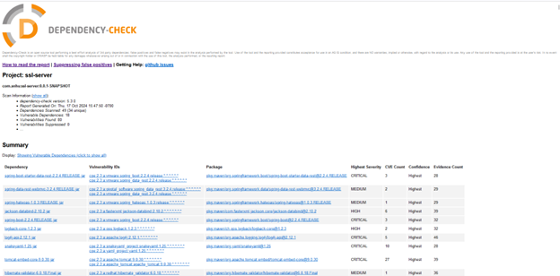
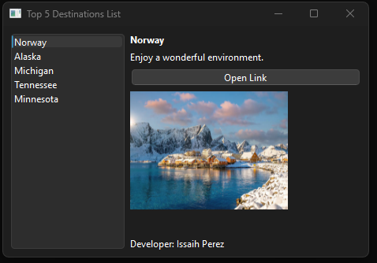
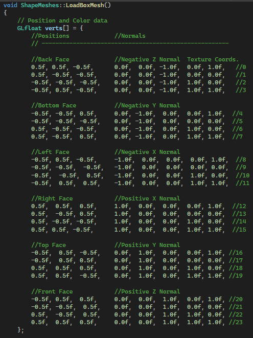

# **Computer Science 499 ePortfolio**

## **Welcome**
Welcome to my ePortfolio, my name is Issaih Perez and this portfolio showcases
the knowledge and skills I have gained and developed throughout the years of
studying a Computer Science Degree while at Southern New Hampshire University (SNHU).

<kbd>
    
</kbd>

## **Professional Self Assessment:**
Throughout my academic and professional journey, I have developed a broad and practical
foundation in computer science, supported by real world applications in software development,
data management, and cybersecurity. My experiences reflect a strong ability to work
collaboratively, communicate effectively with stakeholders, and apply technical expertise in
data structures, algorithms, databases, and secure software development.

### ***Collaborating in a Team Environment:***          
Collaboration has been central to my development as a software engineer. During my senior year
studying at SNHU, I worked on developing a video game prototype that consisted of 10 different working
assets and realistic interactions with the system. My responsibilities included the development of all
of the AI developed assets, different UI or HUD capabilities, and I coordinated closely with teammates
using Agile methodologies, closely monitored and recorded/saved the updated work using Git, and
coordinated/led daily follow up meetings to ensure smooth progress and accurate data retention.

[Link to GAM305 Course](https://github.com/AshwinC89/GAM305Team4)

### ***Communicating with Stakeholders:***
Effective communication with non technical stakeholders has been essential to translating technical
ideas into actionable solutions with non technical audiences. In one of my courses, I developed a
Powerpoint Presentation that demonstrated all of the technical changes made to my work but communicates
the design and functionality choices in a non-technical manner. Being able to effectively communicate
different design elements across varying levels of technical understanding will be paramount in my
success as communicating specialized information effectively helps further my developmental progress
as well as my reputation as effective communication is one of the biggest hurdles developers might face.

### ***Data Structures and Algorithms:***
My proficiency in data structures and algorithms is reflected in several challenging projects. In one
course, I built an Order Tracking system for Quantigration using SQL to locate and filter orders by state,
item SKU, count, and returns. In another, I developed a Course Planner that parsed Excel Data and use a 
hashtable to store and display course information, helping students plan their schedules based on the course
names, numbers and prerequisites. 

### ***Software Engineering and Databases:***           
Throughout my academic terms, I've developed a variety of software programs, some database driven and others
standalone. One notable project involved creating a Top 5 Destinations List for various U.S. states, which
featured clickable links directing users to travel agencies that could assist in booking trips to their chosen
locations. This project focused on enhancing user interaction and providing helfpful resources. In another course,
I planned and developed a DriverPass system that integrated multiple DMV databases and licensed driving instructor 
accounts. The application allowed users to shcedule appointments with available instructors and access official 
DMV study materials, offering a streamlined exdperience for individuals preparing for their driving exams.

[Link to CS 255 Course](https://github.com/IssaihPerez/CS255-System-Analysis-And-Design)

### ***Security:***                                     
Security has been a key theme across several projects. In one, I built an SSL BootSpring Appliction Server using
the SHA-256 Cipher Algorithm to encrypt files with a checksum signature for better security. I also utilized a
Dependency Check tool to analyze and address vulnerabilities in third party libraries, updating insecure packages,
or suppressing false positives where appropriate. This helped minimize my project's security flaws and practiced
defensive design techniques when developing code. In another project, I developed an Appointment Test class that
allowed users to schedule future appointments with verification steps like ID numbers and descriptions. To test this
application, I used JUnit testing to test individual components, combining manual and automated methods to ensure
robust input validation and reduce potential vulnerabilities from unauthorized access or faulty logic. 

[Link to CS 255 Course](https://github.com/IssaihPerez/CS255-System-Analysis-And-Design)

# **Enhanced Artifacts:**

## **Code Review**
Link To Code Review: [Code Review](https://www.youtube.com/watch?v=Prg9hNZymoQ)

### **Software Design and Engineering**
Throughout this degree, I've developed a strong understanding of what it means to be a Computer Science
professional. The first key artifact I chose to demonstrate this was from CS 250 Software Development Lifecycle and it
displays my ability to apply well founded and innovative techniques in real world contexts. This project originally
involved a Java based application, using Swing, that displayed a browser interface with different destinations, allowing
users to explore various travel destinations through clickable links. As part of improving the artifact, I ported
the entire application from Java to C++, which was a challenging task as I had to learn a new to me program called
CMake, which took place of Java's Swing framework. The transition involved thoughtful decision making and trade offs,
particularly in adapting the interface and preserving the application's fuinctionality across different languages and
platforms. From a collaborative perspective, I enhanced the project by integrating interactive features such as external
links, creating a more connected and engaging user experience. This supports collaboration and information sharing
accross different systems, demonstrating how software can bridge gaps between various areas within the field. By combining
strong technical skills with a focus on usability and cross functional collaboration, this artifact represents my growth
as a well rounded and capable Computer Science Professional.

[Link to Artifact Enhancement #1](https://github.com/IssaihPerez/Capstone-2025/blob/main/EnhancementOne.md)

### **Algorithms and Datastructure**
The second artifact I chose was from CS 330 Computational Graphics and Visualization and this artifact showcases my ability
to develop appropriate solutions to complex design problems while effectively balancing the trade offs that come with
different design decisions. The project, completed using SNHU's Virtual Lab environment, involved creating a 3D mesh
scenery executable using various shapes and objects constructed through code. During the outset, I encountered a
challenge as I didn't have all the necessary files to run the program. To overcome this, I tracked down older versions
I had saved of the code and update them to meet my current coding standards and requirements. This process required
not just technical problem solving but also a keen eye for detail and a strong sense of design consistency. Of the 
three chosen artifacts, this one was the most time consuming as much of my time was spent fine tuning and making
deliberate choices about what elements to emphasize. I had to carefully balance components such as lighting, shapes, 
textures pitches, and other visual elements. This iterative refinement process demonstrates my ability to evaluate trade 
offs, prioritize features, and make informed decisions which are skills that are essential both in academic settings and
professional client work. 

[Link to Artifact Enhancement #2](https://github.com/IssaihPerez/Capstone-2025/blob/main/EnhancementTwo.md)

### **Databases**
The final artifact was pulled from CS340 Client Server Development and demonstrates my ability to design, develop, and
deliver technically sound, professional quality work while applying a security focused mindset. Built in Python using
.ipynb and .py files, the project is a web based application that interacts with a database of animals. I restructured
the original setup by consolidating multiple access points into a single entry, improving usability and security. I updated
the CRUD operations for better accuracy and implemented defensive programming practices, such as using .env fields to
protect user's credentials and added additional checks for validating user input to help prevent errors and null entries.
While the backend functionality and CRUD logic work as intended, I encountered an unresolved issue with the Juptyer Dash script.
Due to limitations with the Dash server environment in the Virtual Lab, the dashboard cannot render externally. Despite this,
the core logic performs as expected, showcasing my problem solving and security aware developmental skills. 

[Link to Artifact Enhancement #3](https://github.com/IssaihPerez/Capstone-2025/blob/main/EnhancementThree.md)

    <a href="#">
        <button style="font-size: 10px; font-weight: 500; background: #86C43B; color: #ffffff; border-radius: 50px; border-style: solid; border-color: #4169e1; padding: 5px 8px;">Back to Top &#8593;</button>
    </a>

